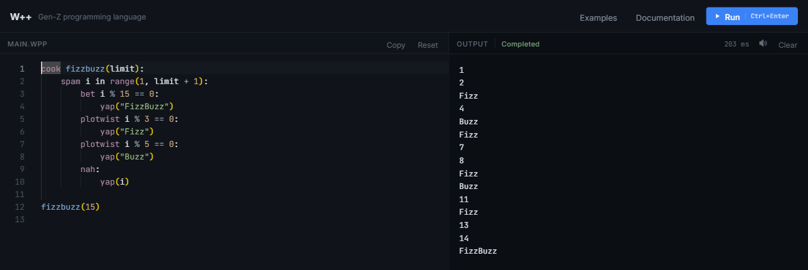
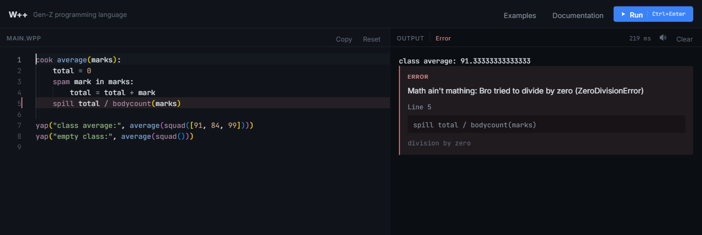
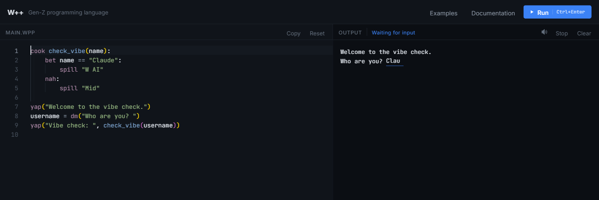
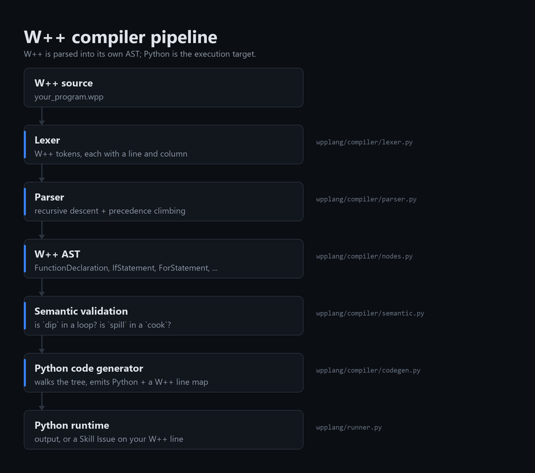

# W++ 🎯

**Live playground: [wplusplus.vercel.app](https://wplusplus.vercel.app/)**


## Basic Details
### Team Name: The Mavericks


### Team Members
- Member 1: Harry Noble - Muthoot Institute of Technology & Science, Kochi
- Member 2: Jinoy Fredy - Muthoot Institute of Technology & Science, Kochi

### Project Description
W++ is a programming language where every keyword is Gen Z slang. You write
`cook` instead of `def`, `yap` instead of `print`, and `bet` instead of `if`.
It has its own lexer, parser, AST and code generator, and compiles to Python -
so it is a real language implementation that happens to be completely unserious.

### The Problem (that doesn't exist)
Programming languages are written in the vocabulary of 1970s computer science.
`def`. `print`. `elif`. Nobody talks like that. An entire generation is being
asked to write `return` when they mean `spill`, and to type `False` when they
clearly mean `cap`. Worse, when your code breaks, Python hands you a wall of
traceback instead of simply telling you it's a skill issue.

### The Solution (that nobody asked for)
We rebuilt the vocabulary. Nineteen keywords, all slang, and a full compiler
frontend behind them so it actually works - loops, functions, classes,
generators, f-strings, the whole standard library. Errors are reported through
the **Skill Issue Protocol**, so dividing by zero now says *"Math ain't mathing:
Bro tried to divide by zero"*, and an infinite loop is stopped with *"Go touch
grass, you've been looping forever"*. There is also an online playground, and a
57-page learning guide, for a language whose `break` statement is called `dip`.

## Technical Details
### Technologies/Components Used
For Software:
- **Languages used:** Python (the compiler), JavaScript (the playground), HTML, CSS
- **Frameworks used:** none - the compiler and web server are pure Python standard library
- **Libraries used:**
  - `tokenize`, `io`, `keyword`, `http.server` - standard library only, for W++ itself
  - [Pyodide](https://pyodide.org/) - CPython on WebAssembly, so the compiler runs in the browser
  - [Monaco Editor](https://microsoft.github.io/monaco-editor/) - the playground's code editor
  - `reportlab` and `Pillow` - used only to build the PDF guide and the favicon, never at runtime
- **Tools used:** Git, Vercel (static hosting), unittest (250 tests)

> **Documentation:** [`docs/WPP_Documentation.pdf`](docs/WPP_Documentation.pdf)
> is a 7-page technical write-up - how the compiler is built, how errors are
> reported against your own source, how the playground runs both locally and in
> the browser, and how it is tested.
> [`docs/REFERENCE.md`](docs/REFERENCE.md) is the full reference: architecture,
> every keyword, the Skill Issue Protocol, deployment and known limitations.
> [`docs/WPP_Guide.pdf`](docs/WPP_Guide.pdf) teaches the language itself.

For Hardware:
- Not applicable - W++ is software only.

### Implementation
For Software:
# Installation
```bash
git clone https://github.com/harrynoble/wplusplus.git
cd wplusplus
```
That is the whole installation. W++ needs **Python 3.8+** and nothing else -
there is no `requirements.txt` because there are no dependencies.

# Run
```bash
# Run a W++ program
python wpp.py examples/fizzbuzz.wpp

# Open the playground in your browser
python playground/server.py

# Look inside the compiler
python wpp.py --tokens examples/hello.wpp   # what the lexer saw
python wpp.py --ast    examples/hello.wpp   # the tree the parser built
python wpp.py --emit   examples/hello.wpp   # the Python it generated

# Run the test suite
python -m unittest discover -s tests -t .
```

Or skip all of that and use the deployed playground:
**[wplusplus.vercel.app](https://wplusplus.vercel.app/)**

Here is a complete W++ program:

```wpp
cook check_vibe(name):
    bet name == "Claude":
        spill "W AI"
    nah:
        spill "Mid"

username = dm("Who are you? ")
yap("Vibe check: ", check_vibe(username))
```

And the nineteen keywords, in full:

| W++ | Python | | W++ | Python | | W++ | Python |
| --- | --- | --- | --- | --- | --- | --- | --- |
| `cook` | `def` | | `nah` | `else` | | `npc` | `None` |
| `spill` | `return` | | `spam` | `for` | | `squad` | `list` |
| `yap` | `print` | | `grind` | `while` | | `tea` | `dict` |
| `dm` | `input` | | `dip` | `break` | | `cult` | `set` |
| `bodycount` | `len` | | `skrrt` | `continue` | | `range` | `range` |
| `bet` | `if` | | `nocap` | `True` | | | |
| `plotwist` | `elif` | | `cap` | `False` | | | |

### Project Documentation
For Software:

# Screenshots (Add at least 3)

*The playground running FizzBuzz - editor on the left with W++ syntax highlighting, integrated output on the right. `spam`, `bet`, `plotwist` and `nah` are doing the work of `for`, `if`, `elif` and `else`.*


*The Skill Issue Protocol. The first call printed a class average; the second divided by zero. The error names the W++ line that caused it - line 5 - quotes that line back, and marks it in the editor. It reports where you wrote the mistake, not where the generated Python failed.*


*Interactive input. When a program calls `dm()`, the prompt appears in the output panel and you type your answer straight after it, exactly like a terminal. The status reads "Waiting for input" and a Stop button appears while the program is paused.*

# Diagrams


*W++ is not find-and-replace. Source is tokenized into W++ tokens, parsed into a
W++ AST, checked for W++ rules, and only then translated into Python by a
separate backend. Python is the execution target, not what W++ is. Every AST
node carries a line and column, and the generator records which W++ line
produced each Python line - which is why an error can point at the line you
actually wrote instead of at generated code you have never seen.*

You can watch it happen. Here is `python wpp.py --ast examples/vibe_check.wpp`,
showing the `check_vibe` function (the tree for the two lines after it continues
below what is quoted here):

```
Program  @1:0
  body:
    FunctionDeclaration  name='check_vibe' keyword='cook' @1:0
      params:
        Parameter  name='name' kind='normal' @1:16
      body:
        IfStatement  @2:4
          branches:
            (
              ComparisonExpression  operators=['=='] @2:8
                left:
                  Identifier  name='name' @2:8
                comparators:
                  Literal  raw='"Claude"' kind='string' @2:16
              ReturnStatement  keyword='spill' @3:8
                value:
                  Literal  raw='"W AI"' kind='string' @3:14
            )
          orelse:
            ReturnStatement  keyword='spill' @5:8
              value:
                Literal  raw='"Mid"' kind='string' @5:14
```

The same compiler runs in two places. Locally, `playground/server.py` executes
each program in a child process. Deployed at
[wplusplus.vercel.app](https://wplusplus.vercel.app/), the identical `wpplang`
package runs under Pyodide inside the visitor's own browser - which is why the
playground can be hosted as static files with no backend, and why it is safe to
make public.

For Hardware:

Not applicable - W++ is software only, so there is no circuit, schematic or build.

## Credits

Built with the help of AI assistants. We used **Claude**, **ChatGPT** and
**Gemini** across the project - for designing the language, working through the
compiler architecture, writing and reviewing code, generating documentation, and
debugging. The keyword dictionary, the Skill Issue Protocol wording and the
design decisions are ours; the AI tools helped us build and refine them.

---
Made with ❤️ at TinkerHub Useless Projects 


